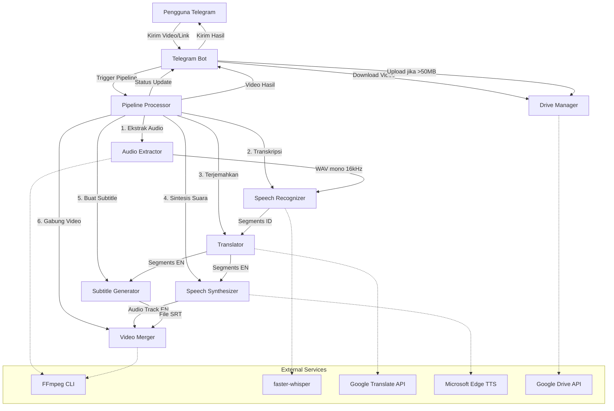
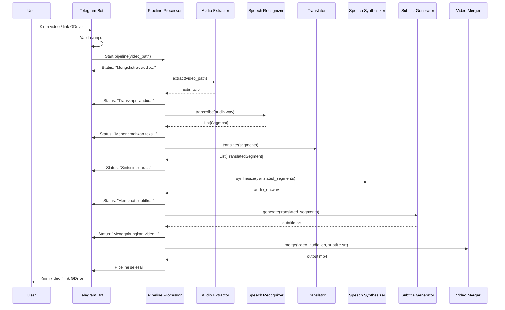
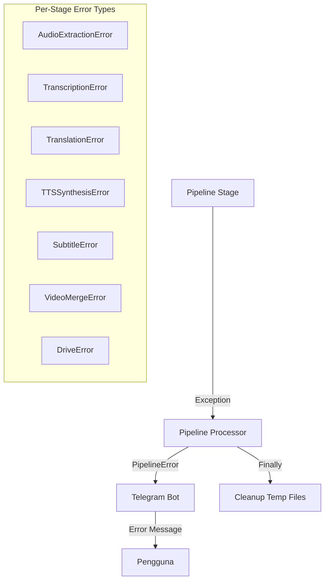

# Design Document: Chess Video Translator

## Overview

Chess Video Translator adalah pipeline otomasi Python yang menerjemahkan video analisis catur berbahasa Indonesia menjadi video dengan audio bahasa Inggris dan subtitle burn-in. Sistem ini beroperasi sebagai Telegram Bot yang menerima video dari pengguna, memprosesnya melalui pipeline sequential (ekstraksi audio → STT → terjemahan → TTS → subtitle → merge), dan mengembalikan video hasil terjemahan.

### Keputusan Desain Utama

1. **Arsitektur Pipeline Sequential**: Setiap tahap dijalankan berurutan karena VPS CPU-only memiliki resource terbatas. Ini menyederhanakan error handling dan resource management.
2. **Modular per Tahap**: Setiap tahap pipeline dienkapsulasi dalam modul terpisah dengan interface yang jelas, memudahkan testing dan penggantian komponen.
3. **Temporary File Management**: Semua file intermediate disimpan di direktori sementara per-job dan dibersihkan setelah selesai (berhasil atau gagal).
4. **Async Telegram Bot + Sync Pipeline**: Telegram Bot menggunakan async (python-telegram-bot v20+), sementara pipeline processing dijalankan di thread terpisah untuk menghindari blocking event loop.

### Teknologi yang Digunakan

| Komponen | Library | Alasan |
|---|---|---|
| Telegram Bot | `python-telegram-bot` v20+ | Library resmi, async native, well-maintained |
| Audio Extraction | FFmpeg (subprocess) | Standard industri untuk manipulasi media |
| Speech-to-Text | `faster-whisper` | 4x lebih cepat dari OpenAI Whisper, mendukung CPU via CTranslate2 |
| Translation | `deep-translator` (GoogleTranslator) | Gratis, mendukung id→en, tidak perlu API key |
| Text-to-Speech | `edge-tts` | Gratis, kualitas tinggi, mendukung rate adjustment via SSML |
| Subtitle | `pysrt` | Library mature untuk parsing/composing file SRT |
| Video Merge | FFmpeg (subprocess) | Mendukung H.264/AAC encoding dan subtitle burn-in |
| Google Drive | `google-api-python-client` | Library resmi Google, mendukung service account |

## Architecture

### Diagram Arsitektur Sistem



### Diagram Sequence Pipeline



## Components and Interfaces

### 1. Telegram Bot (`bot.py`)

Bertanggung jawab untuk menerima input dari pengguna dan mengirim hasil kembali.

```python
class TelegramBotHandler:
    """Handler untuk interaksi Telegram Bot."""
    
    async def handle_video(self, update: Update, context: ContextTypes.DEFAULT_TYPE) -> None:
        """Handle video file yang dikirim pengguna."""
        ...
    
    async def handle_document(self, update: Update, context: ContextTypes.DEFAULT_TYPE) -> None:
        """Handle document (video sebagai file) yang dikirim pengguna."""
        ...
    
    async def handle_message(self, update: Update, context: ContextTypes.DEFAULT_TYPE) -> None:
        """Handle pesan teks (cek Google Drive link atau tampilkan panduan)."""
        ...
    
    async def send_progress(self, chat_id: int, stage: str) -> None:
        """Kirim pesan status progres ke pengguna."""
        ...
    
    async def send_result(self, chat_id: int, video_path: Path) -> None:
        """Kirim video hasil atau link Google Drive jika >50MB."""
        ...
    
    async def send_error(self, chat_id: int, error_message: str) -> None:
        """Kirim pesan error ke pengguna."""
        ...
```

### 2. Pipeline Processor (`pipeline.py`)

Mengorkestrasi seluruh tahapan pemrosesan secara berurutan.

```python
class PipelineProcessor:
    """Orkestrator pipeline pemrosesan video."""
    
    def __init__(self, work_dir: Path, progress_callback: Callable[[str], Awaitable[None]]):
        ...
    
    async def process(self, video_path: Path) -> Path:
        """
        Jalankan pipeline lengkap dan kembalikan path video output.
        Raises PipelineError jika gagal di tahap manapun.
        """
        ...
    
    def cleanup(self) -> None:
        """Hapus semua file sementara di work_dir."""
        ...
```

### 3. Audio Extractor (`audio_extractor.py`)

Mengekstrak audio dari video menggunakan FFmpeg.

```python
class AudioExtractor:
    """Ekstraksi audio dari video menggunakan FFmpeg."""
    
    def extract(self, video_path: Path, output_path: Path) -> Path:
        """
        Ekstrak audio dari video ke WAV mono 16kHz.
        Raises AudioExtractionError jika gagal.
        """
        ...
```

### 4. Speech Recognizer (`speech_recognizer.py`)

Transkripsi audio bahasa Indonesia menggunakan faster-whisper.

```python
class SpeechRecognizer:
    """Transkripsi audio menggunakan faster-whisper."""
    
    def __init__(self, model_size: str = "small", device: str = "cpu"):
        ...
    
    def transcribe(self, audio_path: Path) -> list[Segment]:
        """
        Transkripsi audio dan kembalikan daftar Segment.
        Raises TranscriptionError jika tidak ada ucapan terdeteksi.
        """
        ...
```

### 5. Translator (`translator.py`)

Menerjemahkan teks per segmen dari Indonesia ke Inggris.

```python
class ChessTranslator:
    """Terjemahan teks Indonesia ke Inggris dengan dukungan istilah catur."""
    
    CHESS_TERMS: dict[str, str]  # Mapping istilah catur ID -> EN
    
    def translate_segments(self, segments: list[Segment]) -> list[TranslatedSegment]:
        """
        Terjemahkan semua segmen. Fallback ke teks asli jika gagal per segmen.
        """
        ...
    
    def translate_text(self, text: str) -> str:
        """Terjemahkan satu teks dengan pre-processing istilah catur."""
        ...
    
    def _apply_chess_terms(self, text: str) -> str:
        """Ganti istilah catur Indonesia dengan placeholder sebelum terjemahan."""
        ...
```

### 6. Speech Synthesizer (`speech_synthesizer.py`)

Menghasilkan audio bahasa Inggris yang tersinkronisasi.

```python
class SpeechSynthesizer:
    """Text-to-Speech menggunakan edge-tts dengan sinkronisasi durasi."""
    
    def __init__(self, voice: str = "en-US-AriaNeural"):
        ...
    
    async def synthesize_segments(
        self, segments: list[TranslatedSegment], output_path: Path
    ) -> Path:
        """
        Sintesis audio untuk semua segmen dan gabungkan menjadi satu track.
        Menyesuaikan rate agar durasi cocok dengan segmen asli.
        """
        ...
    
    async def synthesize_single(
        self, text: str, target_duration: float, output_path: Path
    ) -> Path:
        """
        Sintesis satu segmen dengan penyesuaian durasi.
        Trim jika terlalu panjang, pad silence jika terlalu pendek.
        """
        ...
    
    def _calculate_rate(self, text: str, target_duration: float) -> str:
        """Hitung rate adjustment string (e.g., '+20%', '-10%') untuk edge-tts."""
        ...
```

### 7. Subtitle Generator (`subtitle_generator.py`)

Menghasilkan file SRT dari segmen terjemahan.

```python
class SubtitleGenerator:
    """Generator file subtitle SRT."""
    
    MAX_LINE_LENGTH: int = 42
    
    def generate(self, segments: list[TranslatedSegment], output_path: Path) -> Path:
        """
        Buat file SRT dari segmen terjemahan.
        Memecah baris yang melebihi MAX_LINE_LENGTH.
        """
        ...
    
    def _wrap_text(self, text: str) -> str:
        """Pecah teks menjadi baris-baris dengan panjang maksimal MAX_LINE_LENGTH."""
        ...
    
    def format_srt(self, segments: list[TranslatedSegment]) -> str:
        """Format segmen menjadi string SRT."""
        ...
    
    @staticmethod
    def parse_srt(srt_content: str) -> list[TranslatedSegment]:
        """Parse string SRT kembali menjadi daftar segmen."""
        ...
```

### 8. Video Merger (`video_merger.py`)

Menggabungkan video dengan audio baru dan subtitle burn-in.

```python
class VideoMerger:
    """Penggabungan video final menggunakan FFmpeg."""
    
    def merge(
        self, video_path: Path, audio_path: Path, subtitle_path: Path, output_path: Path
    ) -> Path:
        """
        Gabungkan video asli dengan audio baru dan burn-in subtitle.
        Output: MP4 H.264/AAC.
        Raises VideoMergeError jika gagal.
        """
        ...
```

### 9. Drive Manager (`drive_manager.py`)

Mengelola upload/download file dari Google Drive.

```python
class DriveManager:
    """Manajemen file Google Drive menggunakan service account."""
    
    SUPPORTED_URL_PATTERNS: list[str]  # Regex patterns untuk URL Google Drive
    
    def __init__(self, credentials_path: Path, folder_id: str):
        ...
    
    def download(self, drive_url: str, output_path: Path) -> Path:
        """
        Download file dari Google Drive.
        Raises DriveDownloadError jika gagal.
        """
        ...
    
    def upload(self, file_path: Path) -> str:
        """
        Upload file ke Google Drive dan kembalikan shareable link.
        Raises DriveUploadError jika gagal.
        """
        ...
    
    @staticmethod
    def extract_file_id(url: str) -> str | None:
        """Ekstrak file_id dari URL Google Drive."""
        ...
    
    @staticmethod
    def is_drive_url(text: str) -> bool:
        """Cek apakah teks berisi URL Google Drive yang valid."""
        ...
```

## Data Models

### Core Data Models

```python
from dataclasses import dataclass, field
from pathlib import Path
from enum import Enum


@dataclass(frozen=True)
class Segment:
    """Satu unit teks hasil speech-to-text dengan timestamp."""
    start: float       # Timestamp mulai dalam detik
    end: float         # Timestamp selesai dalam detik
    text: str          # Teks transkripsi bahasa Indonesia
    
    @property
    def duration(self) -> float:
        """Durasi segmen dalam detik."""
        return self.end - self.start


@dataclass(frozen=True)
class TranslatedSegment:
    """Segmen yang sudah diterjemahkan ke bahasa Inggris."""
    start: float           # Timestamp mulai (sama dengan Segment asli)
    end: float             # Timestamp selesai (sama dengan Segment asli)
    original_text: str     # Teks asli bahasa Indonesia
    translated_text: str   # Teks terjemahan bahasa Inggris
    
    @property
    def duration(self) -> float:
        """Durasi segmen dalam detik."""
        return self.end - self.start


class PipelineStage(Enum):
    """Tahapan pipeline pemrosesan."""
    AUDIO_EXTRACTION = "Mengekstrak audio..."
    TRANSCRIPTION = "Transkripsi audio..."
    TRANSLATION = "Menerjemahkan teks..."
    TTS_SYNTHESIS = "Sintesis suara bahasa Inggris..."
    SUBTITLE_GENERATION = "Membuat subtitle..."
    VIDEO_MERGE = "Menggabungkan video final..."
    UPLOADING = "Mengupload hasil..."


@dataclass
class PipelineResult:
    """Hasil dari pipeline pemrosesan."""
    success: bool
    output_path: Path | None = None
    error_message: str | None = None
    error_stage: PipelineStage | None = None


@dataclass
class JobContext:
    """Konteks untuk satu job pemrosesan video."""
    chat_id: int
    video_path: Path
    work_dir: Path
    audio_path: Path | None = None
    segments: list[Segment] = field(default_factory=list)
    translated_segments: list[TranslatedSegment] = field(default_factory=list)
    tts_audio_path: Path | None = None
    subtitle_path: Path | None = None
    output_path: Path | None = None
```

### Configuration

```python
@dataclass(frozen=True)
class AppConfig:
    """Konfigurasi aplikasi."""
    telegram_token: str
    google_credentials_path: Path
    google_drive_folder_id: str
    whisper_model: str = "small"
    whisper_device: str = "cpu"
    tts_voice: str = "en-US-AriaNeural"
    max_processing_time: int = 1800  # 30 menit dalam detik
    telegram_file_limit: int = 50 * 1024 * 1024  # 50MB
    supported_formats: tuple[str, ...] = (".mp4", ".avi", ".mkv", ".mov", ".webm")
    temp_dir: Path = Path("/tmp/chess-translator")
```

### Error Hierarchy

```python
class ChessTranslatorError(Exception):
    """Base exception untuk Chess Video Translator."""
    pass

class AudioExtractionError(ChessTranslatorError):
    """Error saat ekstraksi audio."""
    pass

class TranscriptionError(ChessTranslatorError):
    """Error saat transkripsi speech-to-text."""
    pass

class TranslationError(ChessTranslatorError):
    """Error saat terjemahan teks."""
    pass

class TTSSynthesisError(ChessTranslatorError):
    """Error saat sintesis text-to-speech."""
    pass

class SubtitleError(ChessTranslatorError):
    """Error saat pembuatan subtitle."""
    pass

class VideoMergeError(ChessTranslatorError):
    """Error saat penggabungan video."""
    pass

class DriveError(ChessTranslatorError):
    """Base error untuk Google Drive operations."""
    pass

class DriveDownloadError(DriveError):
    """Error saat download dari Google Drive."""
    pass

class DriveUploadError(DriveError):
    """Error saat upload ke Google Drive."""
    pass

class PipelineError(ChessTranslatorError):
    """Error pada level pipeline."""
    def __init__(self, message: str, stage: PipelineStage):
        super().__init__(message)
        self.stage = stage
```

### Validasi Input

```python
GOOGLE_DRIVE_PATTERNS = [
    r"https?://drive\.google\.com/file/d/([a-zA-Z0-9_-]+)",
    r"https?://drive\.google\.com/open\?id=([a-zA-Z0-9_-]+)",
]

SUPPORTED_VIDEO_EXTENSIONS = {".mp4", ".avi", ".mkv", ".mov", ".webm"}

CHESS_TERM_MAPPING: dict[str, str] = {
    "kuda": "knight",
    "benteng": "rook",
    "gajah": "bishop",
    "menteri": "queen",
    "raja": "king",
    "skak mat": "checkmate",
    "skak": "check",
    "bidak": "pawn",
    "rokade": "castling",
    "en passant": "en passant",
    "promosi": "promotion",
    "pat": "stalemate",
    "gambit": "gambit",
    "fianchetto": "fianchetto",
    "pin": "pin",
    "fork": "fork",
    "skewer": "skewer",
}
```

## Correctness Properties

*A property is a characteristic or behavior that should hold true across all valid executions of a system — essentially, a formal statement about what the system should do. Properties serve as the bridge between human-readable specifications and machine-verifiable correctness guarantees.*

### Property 1: Video Format Validation

*For any* file extension string, the validation function SHALL accept it if and only if the lowercased extension is in the set {".mp4", ".avi", ".mkv", ".mov", ".webm"}, and reject all other extensions.

**Validates: Requirements 1.3**

### Property 2: Segment Structural Invariants

*For any* Segment produced by the speech recognizer post-processing, the segment SHALL have `start < end`, `duration > 0`, and non-empty `text`.

**Validates: Requirements 3.2**

### Property 3: Segment Duration Normalization

*For any* list of raw segments with arbitrary durations, after applying the duration normalization function, every resulting segment SHALL have a duration between 0.5 seconds and 15 seconds (inclusive).

**Validates: Requirements 3.3**

### Property 4: Timestamp Preservation During Translation

*For any* list of Segments, after translation to TranslatedSegments, each TranslatedSegment SHALL have `start` and `end` timestamps identical to the corresponding original Segment.

**Validates: Requirements 4.2**

### Property 5: Translation Fallback on Failure

*For any* list of Segments where translation fails for a random subset, the Translator SHALL produce a TranslatedSegment for every input Segment, where failed segments have `translated_text` equal to the original `text`, and the total count of output segments equals the input count.

**Validates: Requirements 4.3**

### Property 6: Chess Term Mapping Correctness

*For any* text string containing one or more chess terms from the mapping (e.g., "kuda", "benteng", "gajah"), the `_apply_chess_terms` function SHALL replace every occurrence of each chess term with its correct English equivalent, and the output SHALL not contain any of the original Indonesian chess terms that were present in the input.

**Validates: Requirements 4.4**

### Property 7: TTS Rate Calculation Format

*For any* valid text string and positive target duration, the `_calculate_rate` function SHALL return a string matching the pattern `[+-]\d+%` (e.g., "+20%", "-10%", "+0%"), representing a valid edge-tts rate adjustment.

**Validates: Requirements 5.2**

### Property 8: Segment Gap Calculation

*For any* ordered list of non-overlapping TranslatedSegments, the calculated silence gap between consecutive segments SHALL equal the difference between the next segment's `start` and the previous segment's `end`, and SHALL be non-negative.

**Validates: Requirements 5.5**

### Property 9: SRT Round-Trip

*For any* list of valid TranslatedSegments, formatting them to an SRT string, parsing the SRT string back to segments, re-formatting to SRT, and parsing again SHALL produce equivalent subtitle objects (same count, same timestamps within SRT precision, same text content).

**Validates: Requirements 6.1, 6.2, 6.4**

### Property 10: Subtitle Line Wrapping

*For any* input text string, after applying the `_wrap_text` function, every line in the output SHALL have a length of 42 characters or fewer, and the concatenation of all output lines (ignoring line breaks) SHALL contain all words from the original text.

**Validates: Requirements 6.3**

### Property 11: File Size Delivery Routing

*For any* non-negative file size in bytes, the delivery routing function SHALL choose "direct Telegram send" if and only if the size is ≤ 50MB (52,428,800 bytes), and "Google Drive upload" otherwise.

**Validates: Requirements 8.1, 8.2**

### Property 12: Error Message Stage Inclusion

*For any* PipelineStage value and arbitrary error message string, the formatted user-facing error message SHALL contain the human-readable name of the pipeline stage where the error occurred.

**Validates: Requirements 8.4**

### Property 13: Google Drive URL Parsing

*For any* alphanumeric file ID string, constructing a Google Drive URL in either supported format (`/file/d/{id}` or `/open?id={id}`) and then calling `extract_file_id` SHALL return the original file ID.

**Validates: Requirements 9.5**

## Error Handling

### Strategi Error Handling

Sistem menggunakan pendekatan **fail-fast per stage** dengan **graceful degradation** di level pipeline:

1. **Per-Stage Errors**: Setiap modul pipeline melempar exception spesifik (lihat Error Hierarchy di Data Models). Exception berisi pesan deskriptif tentang penyebab kegagalan.

2. **Pipeline-Level Handling**: `PipelineProcessor` menangkap exception dari setiap stage, membungkusnya dalam `PipelineError` dengan informasi stage, dan melaporkan ke Telegram Bot.

3. **Translation Fallback**: Satu-satunya stage dengan graceful degradation — jika terjemahan satu segmen gagal, gunakan teks asli sebagai fallback (Requirement 4.3).

4. **Cleanup Guarantee**: `PipelineProcessor.cleanup()` dipanggil dalam blok `finally` untuk memastikan file sementara selalu dihapus, baik pipeline berhasil maupun gagal.

5. **Timeout Protection**: Pipeline dibungkus dengan `asyncio.wait_for()` dengan timeout 30 menit. Jika timeout tercapai, `asyncio.TimeoutError` ditangkap dan dilaporkan sebagai timeout.

### Error Flow



### Pesan Error ke Pengguna

Setiap error yang dilaporkan ke pengguna mengikuti format:

```
❌ Pemrosesan gagal pada tahap: {nama_tahap}
Detail: {pesan_error}

Silakan coba lagi atau hubungi admin jika masalah berlanjut.
```

## Testing Strategy

### Pendekatan Dual Testing

Sistem ini menggunakan kombinasi **unit tests**, **property-based tests**, dan **integration tests** untuk coverage yang komprehensif.

### Property-Based Tests (Hypothesis)

Library yang digunakan: **[Hypothesis](https://hypothesis.readthedocs.io/)** — library PBT paling mature untuk Python.

Konfigurasi:
- Minimum **100 iterasi** per property test
- Setiap test di-tag dengan komentar referensi ke design property
- Format tag: `Feature: chess-video-translator, Property {number}: {property_text}`

Property tests mencakup 13 properties yang didefinisikan di bagian Correctness Properties:

| Property | Modul yang Ditest | Tipe |
|---|---|---|
| 1: Video Format Validation | `bot.py` (validation) | Invariant |
| 2: Segment Structural Invariants | `speech_recognizer.py` | Invariant |
| 3: Segment Duration Normalization | `speech_recognizer.py` | Invariant |
| 4: Timestamp Preservation | `translator.py` | Invariant |
| 5: Translation Fallback | `translator.py` | Error Condition |
| 6: Chess Term Mapping | `translator.py` | Metamorphic |
| 7: TTS Rate Calculation | `speech_synthesizer.py` | Invariant |
| 8: Segment Gap Calculation | `speech_synthesizer.py` | Invariant |
| 9: SRT Round-Trip | `subtitle_generator.py` | Round-Trip |
| 10: Subtitle Line Wrapping | `subtitle_generator.py` | Invariant |
| 11: File Size Routing | `bot.py` (routing) | Invariant |
| 12: Error Message Stage | `pipeline.py` | Invariant |
| 13: Drive URL Parsing | `drive_manager.py` | Round-Trip |

### Unit Tests (pytest)

Unit tests fokus pada:
- **Contoh spesifik**: Terjemahan istilah catur tertentu (e.g., "kuda" → "knight")
- **Edge cases**: Video tanpa audio, audio tanpa ucapan, file corrupt
- **Error conditions**: Google Drive auth failure, FFmpeg failure, timeout
- **Specific scenarios**: Pesan panduan untuk input tanpa video

### Integration Tests

Integration tests memvalidasi:
- Pipeline end-to-end dengan file video kecil
- Telegram Bot handler dengan mock Update objects
- Google Drive upload/download dengan mock API
- FFmpeg command construction dan execution
- Pipeline stage ordering dan progress callback

### Struktur Direktori Test

```
tests/
├── conftest.py                    # Shared fixtures (sample segments, configs)
├── test_properties/               # Property-based tests
│   ├── test_format_validation.py  # Property 1
│   ├── test_segment_props.py      # Property 2, 3
│   ├── test_translator_props.py   # Property 4, 5, 6
│   ├── test_tts_props.py          # Property 7, 8
│   ├── test_subtitle_props.py     # Property 9, 10
│   ├── test_routing_props.py      # Property 11
│   ├── test_pipeline_props.py     # Property 12
│   └── test_drive_props.py        # Property 13
├── test_unit/                     # Unit tests
│   ├── test_audio_extractor.py
│   ├── test_speech_recognizer.py
│   ├── test_translator.py
│   ├── test_speech_synthesizer.py
│   ├── test_subtitle_generator.py
│   ├── test_video_merger.py
│   └── test_drive_manager.py
└── test_integration/              # Integration tests
    ├── test_pipeline.py
    ├── test_bot_handlers.py
    └── fixtures/                  # Small test media files
        └── sample_video.mp4
```
